# Fabric Commerce Operating System: Agentic System Architecture

## 1. Architecture Overview

The Fabric Commerce Operating System is built on a modular, event-driven architecture leveraging specialized AI agents to create an intelligent digital twin of the entire physical supply chain. The system architecture follows a layered approach with clear separation of concerns while enabling seamless data flow and decision-making across all components.

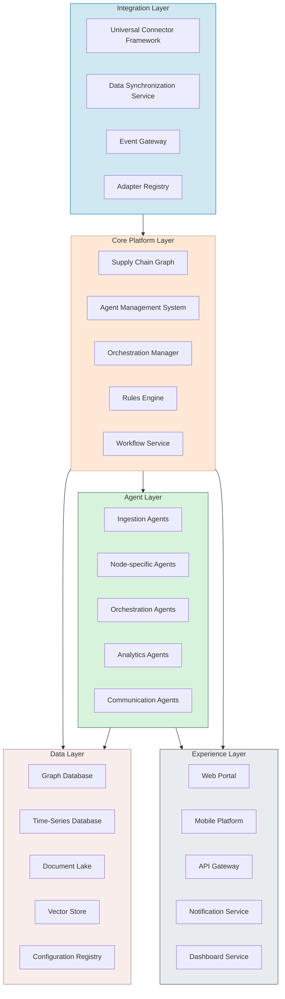

## 2. Layer Descriptions

### 2.1 Integration Layer

The Integration Layer creates a universal interface between the platform and the diverse ecosystem of supply chain participants, from manufacturers to return centers.

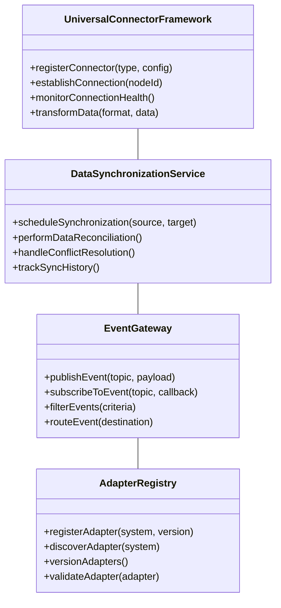

**Key Components:**

- **Universal Connector Framework**: Standardized interface for connecting to any supply chain node regardless of technology stack or communication protocol (EDI, APIs, file transfers, etc.)
- **Data Synchronization Service**: Manages bidirectional data flow between Fabric and external systems with conflict resolution and versioning
- **Event Gateway**: Handles real-time events from across the supply chain, routing them to appropriate platform components
- **Adapter Registry**: Maintains a versioned catalog of all system integrations with configuration templates for common supply chain platforms

### 2.2 Core Platform Layer

The Core Platform Layer serves as the central nervous system of the Fabric Commerce Operating System, coordinating all operations and maintaining the system state.

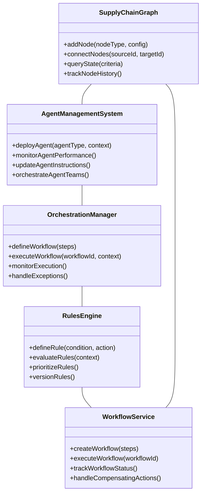

**Key Components:**

- **Supply Chain Graph**: Digital representation of all supply chain nodes, connections, and states, enabling complete visibility and tracking
- **Agent Management System**: Controls the deployment, monitoring, and updating of AI agents across the platform
- **Orchestration Manager**: Coordinates complex multi-step processes across different supply chain nodes
- **Rules Engine**: Governs system behavior through configurable business rules and constraints
- **Workflow Service**: Manages and executes supply chain processes with state tracking and compensation handling

### 2.3 Agent Layer

The Agent Layer contains specialized AI agents that perform specific functions across the supply chain, leveraging domain-specific knowledge and capabilities.

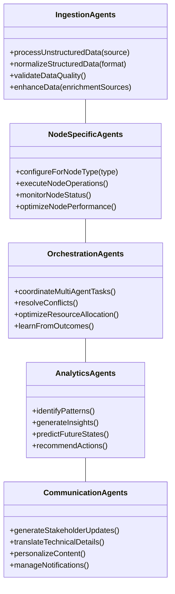

**Key Components:**

- **Ingestion Agents**: Transform diverse data inputs (structured and unstructured) into normalized platform formats
- **Node-specific Agents**: Specialized agents for different supply chain functions (manufacturing, warehousing, transportation, retail, returns) with domain-specific capabilities
- **Orchestration Agents**: Meta-agents that coordinate activities across multiple specialized agents
- **Analytics Agents**: Identify patterns, generate insights, and provide predictive capabilities
- **Communication Agents**: Generate and deliver information to human stakeholders in appropriate formats

### 2.4 Data Layer

The Data Layer provides specialized storage for different types of supply chain data with appropriate access patterns.

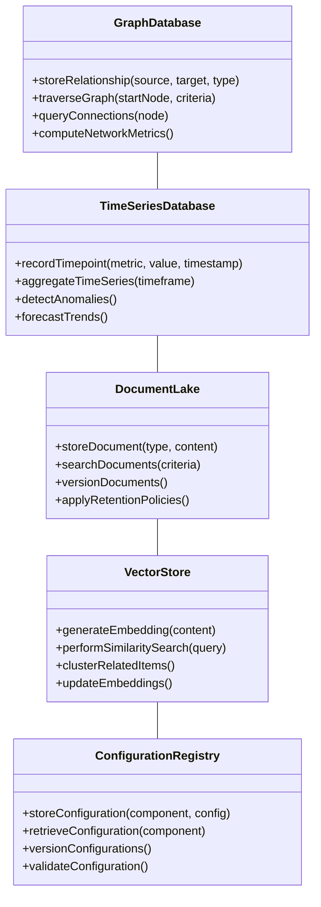

**Key Components:**

- **Graph Database**: Stores the supply chain network structure with nodes, relationships, and properties
- **Time Series Database**: Captures historical performance metrics, sensor data, and temporal patterns
- **Document Lake**: Maintains semi-structured and unstructured data such as contracts, manifests, and communications
- **Vector Store**: Enables semantic search and similarity matching across supply chain entities
- **Configuration Registry**: Manages versioned configurations for all system components with governance controls

### 2.5 Experience Layer

The Experience Layer provides tailored interfaces for different stakeholders to interact with the Fabric platform.

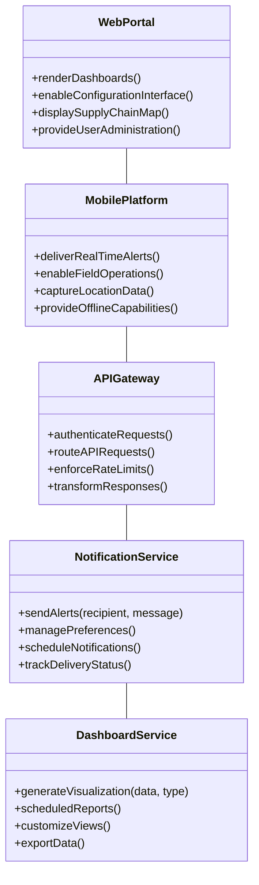

**Key Components:**

- **Web Portal**: Comprehensive management interface for supply chain visualization and configuration
- **Mobile Platform**: Field-optimized applications for on-the-go access and operations
- **API Gateway**: Secure interface for external systems to interact with the platform
- **Notification Service**: Multi-channel alert system for critical supply chain events
- **Dashboard Service**: Customizable visualization and reporting capabilities

## 3. Agent Architecture Design

The agent architecture is a crucial element of the Fabric platform, enabling the intelligence and adaptability of the system.

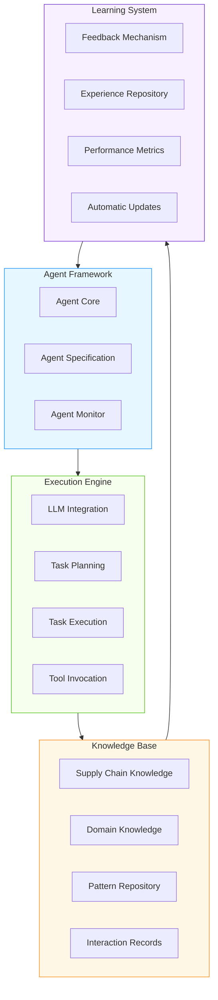

### 3.1 Agent Types and Specializations

Each agent type is designed with specific parameters and capabilities:

| Agent Type | Temperature | p99 | Primary Function | Example Specializations |
| ---------- | ----------- | --- | --------------- | ----------------------- |
| Ingestion Agents | 0.1 | 95% | Data transformation | EDI Parser, Document Extractor, Image Analyzer |
| Inventory Agents | 0.2 | 99.5% | Stock management | Stock Level Optimizer, Reorder Point Calculator |
| Transportation Agents | 0.2 | 98% | Logistics optimization | Route Planner, Carrier Selector, Delivery Estimator |
| Warehouse Agents | 0.2 | 99% | Facility operations | Pick Path Optimizer, Space Utilizer, Labor Allocator |
| Returns Agents | 0.3 | 97% | Reverse logistics | Return Classifier, Disposition Recommender |
| Analytics Agents | 0.4 | 95% | Insight generation | Trend Spotter, Anomaly Detector, Forecaster |
| Orchestration Agents | 0.1 | 99.9% | Cross-agent coordination | Workflow Manager, Conflict Resolver, Priority Setter |

### 3.2 Agent Instruction Management

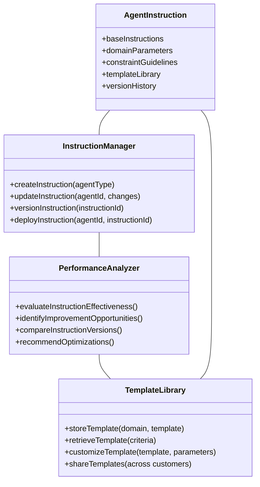

## 4. Supply Chain Graph Model

The Supply Chain Graph is the central data structure representing the digital twin of physical supply chain operations.

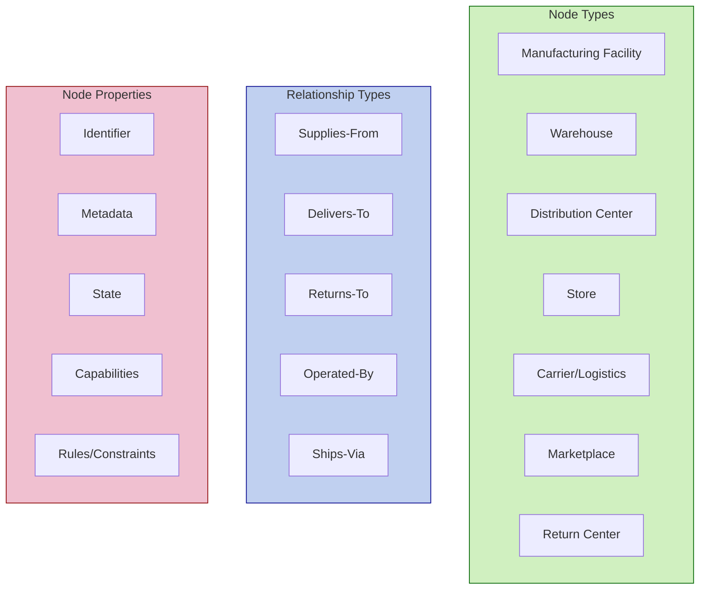

### 4.1 Node Configuration and Management

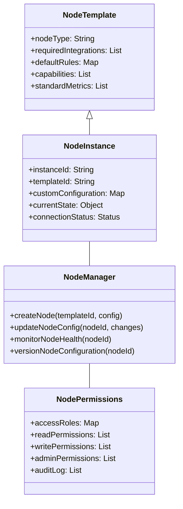

## 5. Data Flow Architecture

The data flow architecture illustrates how information moves through the system from ingestion to insights.

```mermaid
graph LR
    subgraph ES["External Sources"]
        MF1["Manufacturing Systems"]
        WMS["Warehouse Management"]
        TMS["Transportation Management"]
        RMS["Retail Management"]
        RLS["Returns Systems"]
    end

    subgraph IP["Ingestion Processing"]
        CR1["Connectors"]
        IA1["Ingestion Agents"]
        DT1["Data Transformation"]
        DV["Data Validation"]
    end

    subgraph DS3["Data Storage"]
        OD["Operational Data"]
        HD["Historical Data"]
        MD1["Master Data"]
        CD["Configuration Data"]
    end

    subgraph AP["Analytics Processing"]
        RT1["Real-time Analysis"]
        DP["Data Processing"]
        ML["Machine Learning"]
        VZ["Visualization"]
    end

    subgraph AA["Actions & Automation"]
        AL["Alerts"]
        RC1["Recommendations"]
        AT["Automated Tasks"]
        HI["Human Intervention"]
    end

    ES --> IP
    IP --> DS3
    DS3 --> AP
    AP --> AA
    AA --> ES

    style ES fill:#f9f9f9,stroke:#666
    style IP fill:#e6f7ff,stroke:#1890ff
    style DS3 fill:#f6ffed,stroke:#52c41a
    style AP fill:#fff7e6,stroke:#fa8c16
    style AA fill:#f9f0ff,stroke:#722ed1
```

### 5.1 Event Processing Model

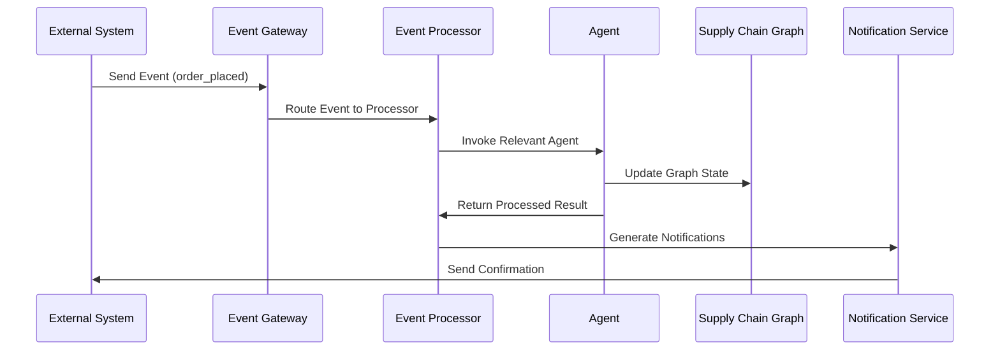

## 6. Security Architecture

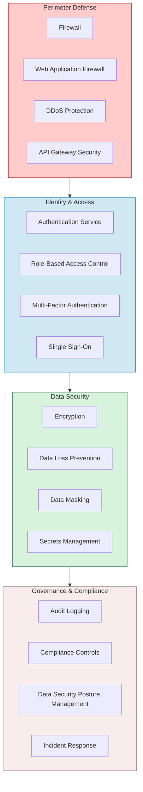

### 6.1 Multi-Tenant Data Isolation

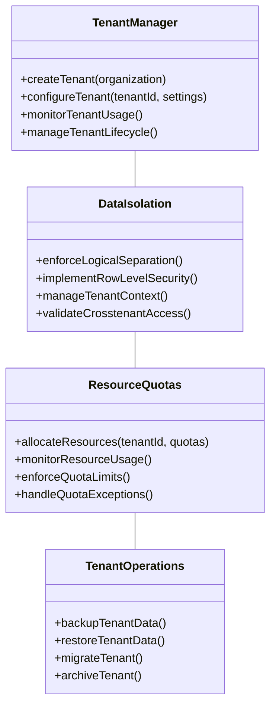

## 7. Deployment Architecture

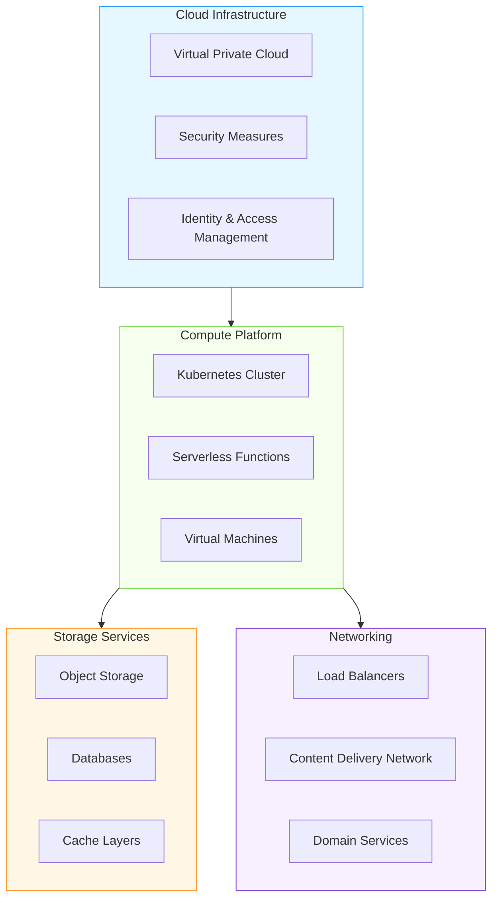

### 7.1 Microservices Architecture

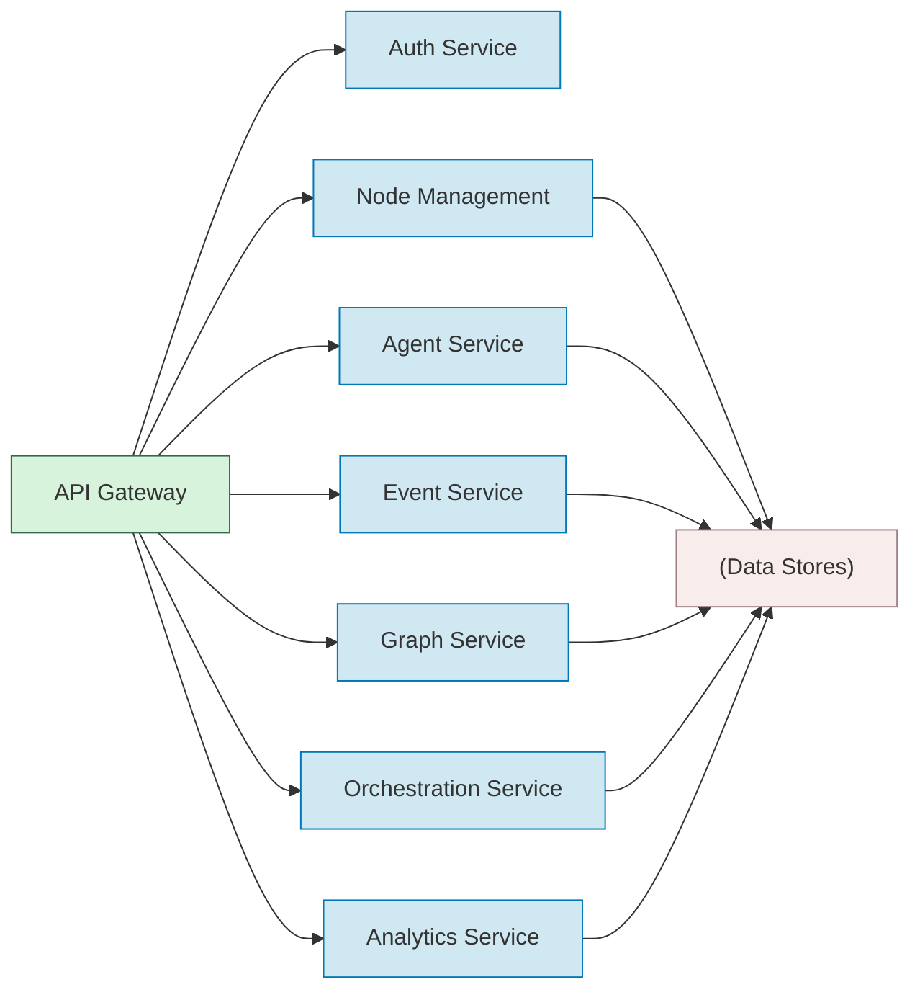

## 8. Scaling Architecture

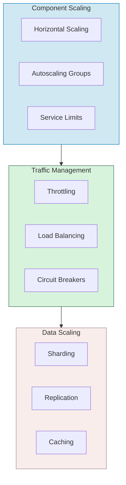

## 9. Implementation Considerations

### 9.1 Technology Stack

| Component | Recommended Technologies |
| --------- | ------------------------ |
| Application Framework | Node.js, Go, Python |
| Agent Runtime | FastAPI, LangChain, LlamaIndex |
| Graph Database | Neo4j, Amazon Neptune |
| Time Series Database | InfluxDB, TimescaleDB |
| Document Store | MongoDB, Elasticsearch |
| Vector Database | Pinecone, Weaviate |
| Message Queue | Kafka, RabbitMQ |
| Container Orchestration | Kubernetes, ECS |
| Frontend | React, Next.js |
| ML Framework | PyTorch, TensorFlow |
| LLM Integration | Claude API, OpenAI API |
| API Management | Kong, Apigee |

### 9.2 Development Approach

- **API-First Design**: All functionality exposed through well-documented APIs
- **Domain-Driven Design**: Align architecture with supply chain domain concepts
- **Event Sourcing**: Maintain complete audit trail of all state changes
- **CQRS Pattern**: Separate read and write operations for optimal performance
- **Microservices Architecture**: Independent services with clear boundaries
- **Infrastructure as Code**: Automated deployment and configuration
- **Continuous Integration/Deployment**: Automated testing and release pipelines

## 10. Future Expansion Areas

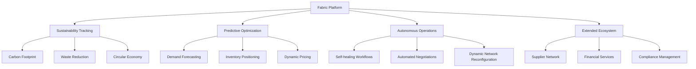

This comprehensive architecture provides the foundation for implementing the Fabric Commerce Operating System with agentic capabilities that transform supply chain operations.
