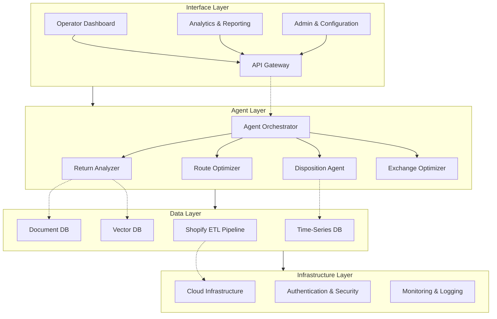
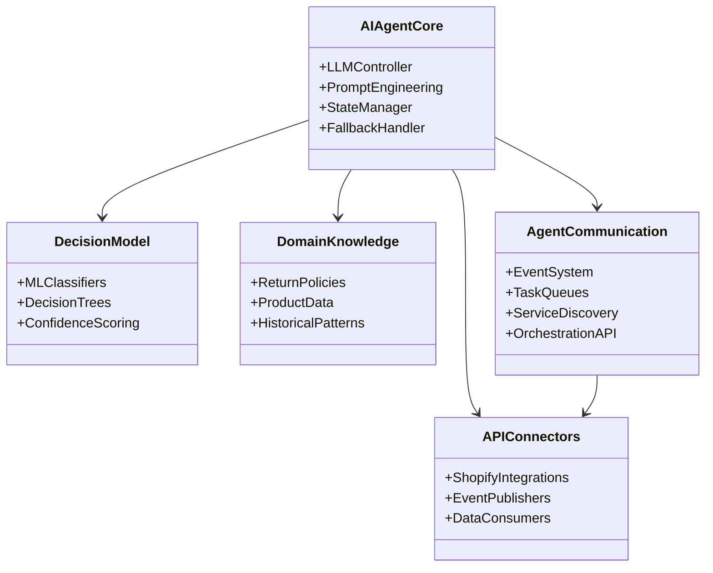
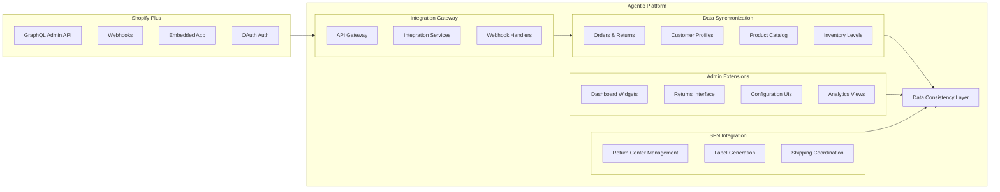
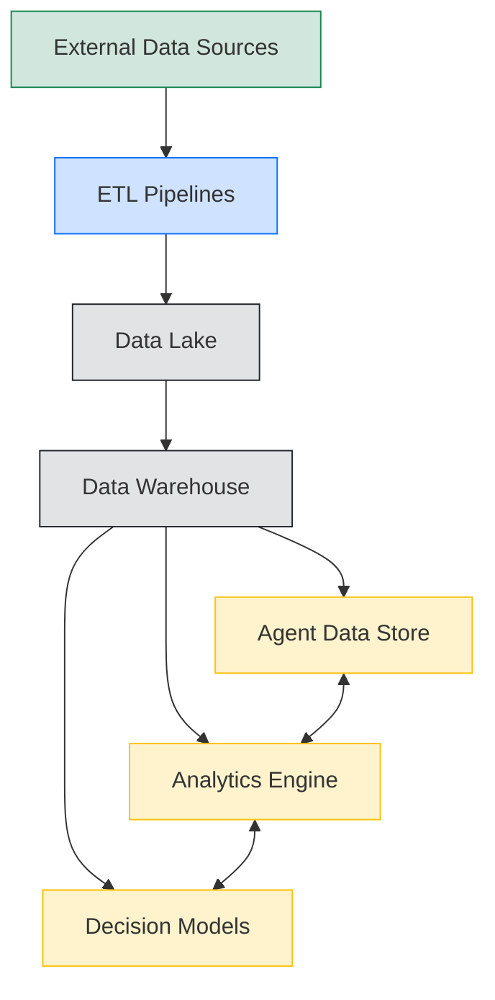
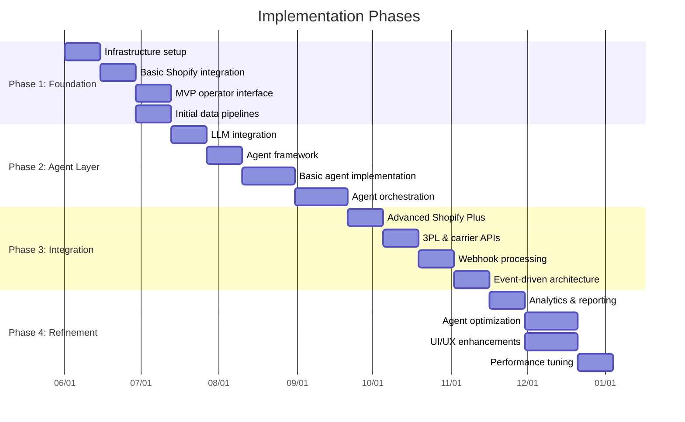
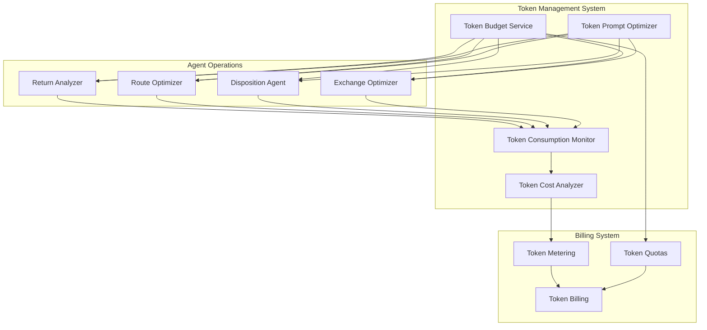

# AI Commerce Agentic Platform: Software Architecture

## 1. System Architecture Overview

The AI Commerce Agentic Platform uses a layered microservices architecture with event-driven communication between specialized AI agents. Each agent handles a specific aspect of the reverse logistics process, with an orchestrator coordinating workflows.

### 1.1 Layer Breakdown

#### Interface Layer
- **Operator Dashboard**: Supply chain operator's main interface
- **Analytics & Reporting**: Performance metrics and business insights
- **Admin & Configuration**: Platform management and settings
- **API Gateway**: External integration point and security boundary

#### Agent Layer
- **Return Analyzer**: Assesses return reason and product condition
- **Route Optimizer**: Determines optimal return path and facility
- **Disposition Agent**: Recommends optimal recovery actions
- **Exchange Optimizer**: Maximizes revenue through exchange suggestions
- **Agent Orchestrator**: Coordinates workflows and manages task allocation

#### Data Layer
- **Shopify ETL Pipeline**: Data extraction, transformation, and loading
- **Document DB**: Stores structured data (orders, returns, products)
- **Time-Series DB**: Stores metrics and performance data
- **Vector DB**: Manages embeddings for semantic search and similarity

#### Infrastructure Layer
- **Cloud Infrastructure**: AWS-based microservices platform
- **Authentication & Security**: Identity, encryption, and access control
- **Monitoring & Logging**: Observability and diagnostics

## 2. Agent Architecture

Each AI agent follows a consistent internal architecture:

### 2.1 AI Agent Core
- **LLM Controller**: Manages token usage, batching, and API calls
- **Prompt Engineering**: Templates and dynamic context generation
- **State Manager**: Maintains agent memory and processing state
- **Fallback Handler**: Error recovery and graceful degradation

### 2.2 Decision Making
- **Decision Models**: ML classification models and algorithms
- **Domain Knowledge**: Business rules and logistics expertise
- **Confidence Scoring**: Reliability assessment of recommendations

### 2.3 Communication
- **Event System**: Async message passing between agents
- **Task Queues**: Prioritized processing with rate limiting
- **Service Discovery**: Dynamic agent registration and discovery
- **Orchestration API**: Coordination interface for complex workflows

## 3. Shopify Plus Integration

The integration is designed for reliability and scalability:

### 3.1 Integration Components

- **API Gateway**: Manages authentication, rate limiting, and routing
- **Integration Services**: Transform and normalize data
- **Webhook Handlers**: Process real-time events from Shopify
- **Data Synchronization**: Maintain consistent data across systems
- **Admin Extensions**: Custom UI components within Shopify admin
- **SFN Integration**: Connect with Shopify Fulfillment Network
- **Data Consistency Layer**: Event-sourced architecture with Change Data Capture

### 3.2 Integration Patterns

- **OAuth Flow**: Secure merchant authorization
- **Webhook Processing**: Real-time event handling with idempotence
- **GraphQL Queries**: Efficient data retrieval with pagination
- **Embedded App Framework**: Seamless UI integration
- **Rate Limiting**: Smart retry and backoff strategies

## 4. Data Flow Architecture

The platform uses sophisticated data patterns:

### 4.1 Data Flow Patterns

- **Real-time Streaming**: Immediate processing of return events
- **Batch Processing**: Historical analysis and model training
- **Event Sourcing**: Immutable log of all state changes
- **CQRS**: Separate read and write operations
- **Data Privacy Zones**: Segmentation of PII and sensitive data

### 4.2 Data Processing Components

- **ETL Pipelines**: Extract, transform, load data from Shopify and 3PLs
- **Data Lake**: Raw storage of all ingested data
- **Data Warehouse**: Structured and optimized for analytics
- **Agent Data Store**: Specialized storage for agent operations
- **Analytics Engine**: Business intelligence and reporting
- **Decision Models**: ML models for agent recommendations

## 5. Technical Risks & Mitigations

| Risk Area | Challenge | Mitigation |
|-----------|-----------|------------|
| **AI/LLM Integration** | Token costs, latency, reliability | Caching, batching, prompt optimization, fallback mechanisms |
| **Shopify Integration** | API rate limits, webhook reliability | Rate limiting, retry mechanisms, idempotent processing |
| **Scalability** | Peak loads during high return periods | Horizontal scaling, queue-based processing, elastic infrastructure |
| **Data Security** | PII protection, cross-merchant isolation | Encryption, data partitioning, IAM, GDPR compliance |
| **Agent Orchestration** | Complex workflows, race conditions | State machine design, sagas, compensation patterns |
| **Third-Party Integrations** | 3PL, carrier API reliability | Adapter pattern, circuit breakers, fallback processes |
| **Model Accuracy** | Recommendation quality, confidence | Human-in-the-loop validation, continuous learning |

## 6. Implementation Approach

A phased implementation is recommended:

### 6.1 Phased Implementation

1. **Foundation (6-8 weeks)**
   - Core infrastructure setup
   - Basic Shopify integration
   - MVP operator interface
   - Initial data pipelines

2. **Agent Layer (8-10 weeks)**
   - LLM integration & token management
   - Agent framework development
   - Basic agent implementation
   - Agent orchestration service

3. **Integration (6-8 weeks)**
   - Advanced Shopify Plus integration
   - 3PL & carrier API connections
   - Webhook processing system
   - Event-driven architecture

4. **Refinement (8-10 weeks)**
   - Advanced analytics & reporting
   - Agent performance optimization
   - UI/UX enhancements
   - Scaling & performance tuning

## 7. Technology Stack

### 7.1 Backend Services
- Node.js / TypeScript
- NestJS framework
- gRPC for inter-service communication
- Redis for caching and pub/sub
- RabbitMQ for message queuing
- Kubernetes for orchestration

### 7.2 Frontend
- React / TypeScript
- Next.js for SSR
- Tailwind CSS for styling
- React Query for data fetching
- D3.js for data visualization
- Shopify Polaris design system

### 7.3 Data Storage
- MongoDB for document storage
- PostgreSQL for relational data
- InfluxDB for time-series metrics
- Pinecone for vector embeddings
- Redis for caching
- S3 for file storage

### 7.4 AI / ML
- Claude API (Anthropic)
- TensorFlow for custom ML models
- LangChain for agent frameworks
- Hugging Face for tokenization
- MLflow for model tracking
- Custom token management system

### 7.5 DevOps & Monitoring
- AWS Cloud infrastructure
- Terraform for IaC
- GitHub Actions for CI/CD
- Prometheus & Grafana
- ELK Stack for logging
- Sentry for error tracking

## 8. Token Management Architecture

Special attention is given to token management for the hybrid SaaS + token pricing model:

### 8.1 Token Management Components

- **Token Budget Service**: Allocates token budgets across agents
- **Token Prompt Optimizer**: Minimizes token usage in prompts
- **Token Consumption Monitor**: Tracks real-time usage by merchant
- **Token Cost Analyzer**: Identifies optimization opportunities
- **Token Metering**: Accurate counting of consumed tokens
- **Token Quotas**: Enforces merchant-specific limits
- **Token Billing**: Generates usage-based invoices

### 8.2 Token Optimization Techniques

- Caching common responses
- Compression of context windows
- Efficient prompt engineering
- Batch processing of similar requests
- Staged agent invocation
- Vectorization of frequently accessed data
- Smart fallback to rule-based systems

## 9. Team Structure

### 9.1 Core Implementation Team
- Engineering Lead
- Product Manager
- UX Designer
- AI/ML Specialists (2)
- Backend Engineers (3)
- Frontend Engineers (2)
- Data Engineers (2)
- DevOps Engineer
- QA Engineer

### 9.2 Organization
- Total team size: 13 engineers + PM and designer
- Cross-functional pods aligned to key platform capabilities
- DevOps and QA embedded within development teams

## 10. Development Methodology

### 10.1 Approach
- Agile methodology with 2-week sprints
- Domain-Driven Design (DDD) for business logic
- Event Sourcing for state management
- CQRS for data access patterns
- Microservices with clear bounded contexts
- Test-Driven Development with high test coverage
- Feature flags for controlled rollout

### 10.2 Key Metrics
- Agent recommendation accuracy
- Token usage efficiency
- Latency and throughput
- Cost per return processed
- Value recovery improvement
- Customer satisfaction with returns process

This architecture provides a comprehensive framework for implementing the AI Commerce Agentic Platform, with special attention to the token-based pricing model through the dedicated Token Management System.
