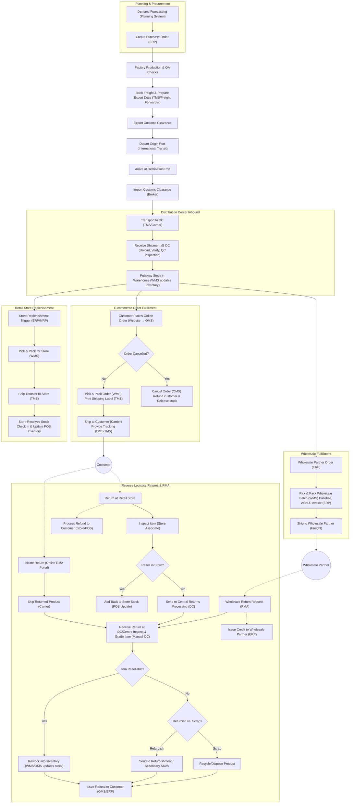

# Supply Chain and Reverse Logistics Flow

## 1. End-to-End Supply Chain Flow

This diagram illustrates the complete supply chain and reverse logistics flow, from planning and procurement through multi-channel fulfillment to returns processing.

## 2. Key Process Areas

### 2.1 Planning & Procurement
The supply chain begins with forecasting demand and creating purchase orders, ensuring the right products are ordered in the right quantities.

### 2.2 International Logistics
This section covers the movement of goods from factories to destination markets, including export/import processes and customs clearance.

### 2.3 Distribution Center Operations
The central hub for receiving, inspecting, and storing inventory before it's distributed through various channels.

### 2.4 Multi-Channel Fulfillment
Products flow through three primary channels:
- E-commerce direct-to-consumer orders
- Retail store replenishment
- Wholesale partner orders

### 2.5 Reverse Logistics
The comprehensive returns processing system handles products coming back through various channels:
- Direct returns from customers (via mail)
- In-store returns
- Wholesale partner returns

## 3. Systems Integration

The flow diagram illustrates how various systems integrate across the supply chain:

- **ERP/MRP Systems**: Manage planning, procurement, and wholesale orders
- **WMS (Warehouse Management System)**: Controls inventory and fulfillment operations
- **TMS (Transportation Management System)**: Handles shipping, routing, and tracking
- **OMS (Order Management System)**: Processes customer orders and manages fulfillment
- **POS (Point of Sale)**: Manages in-store inventory and transactions
- **RMA (Return Merchandise Authorization)**: Facilitates returns processing

## 4. Reverse Logistics Focus

The reverse logistics portion of the flow demonstrates multiple return pathways:

1. **Online Returns**: Customer-initiated returns through an RMA portal
2. **In-Store Returns**: Returns processed at retail locations
3. **Wholesale Returns**: B2B returns from wholesale partners

Each return type follows a structured process:
- Return initiation and transportation
- Receiving and inspection
- Disposition decision (resell, refurbish, or discard)
- Financial reconciliation (refunds or credits)

This integrated view of forward and reverse logistics demonstrates how a modern supply chain operates as a complete cycle, with product returns forming a critical component of the overall operational flow.